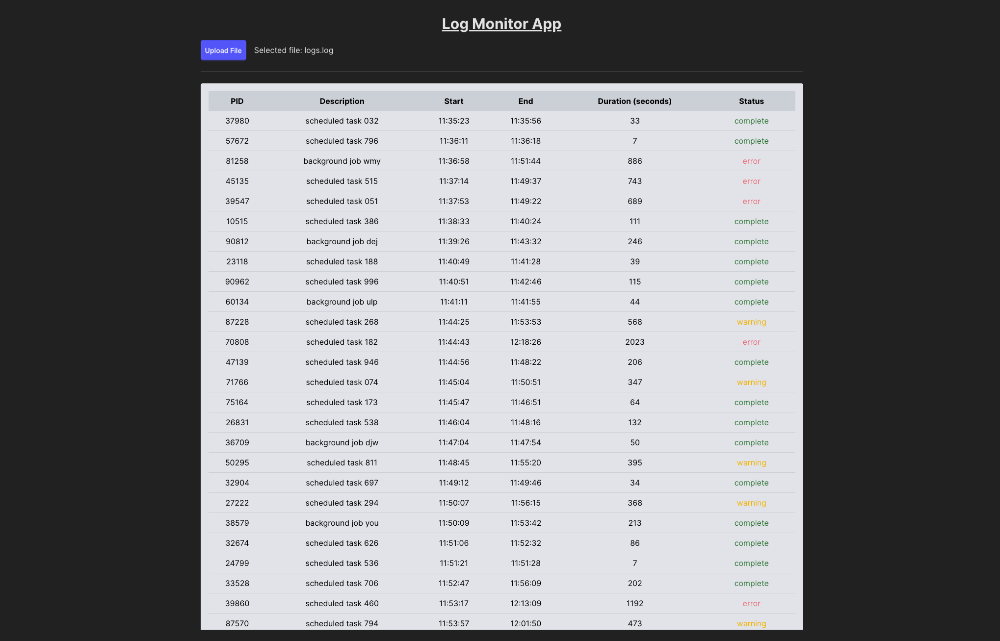

# Log Monitoring Application

A web-based **log monitoring** that reads a log file, calculates job durations, and generates warnings/errors based on processing time.



## **Dependencies**

- **[React](https://react.dev/)** - Frontend framework
- **[Vite.js](https://vitejs.dev/)** - Fast build tool for modern frontend projects
- **[tailwindcss](https://tailwindcss.com/)** - Utility-first CSS framework
- **[daisyui](https://daisyui.com/)** - TailwindCSS component library
- **[classnames](https://www.npmjs.com/package/classnames)** - Utility for conditionally joining classNames
- **[date-fns](https://date-fns.org/)** - For time parsing and calculations
- **[eslint](https://eslint.org/)** - JavaScript linter for code quality
- **[prettier](https://prettier.io/)** - Code formatter for consistent styling
- **[vitest](https://vitest.dev/)** - Unit testing framework for Vite
- **[testing-library](https://testing-library.com/)** - Testing library for DOM manipulation

---

## **Installation**

#### Pre-install

- **[node.js](https://nodejs.org/en/download)**
- **[yarn](https://classic.yarnpkg.com/lang/en/docs/install)**

#### 1. Clone the repository

```sh
git clone https://github.com/wintory/log-monitor-web.git
cd log-monitor
```

#### 2. Install dependencies

```sh
yarn install
```

#### 3. Start the development server

```sh
yarn dev
```

Vite will start the server and provide a local development URL.

---

### How to Use

- Click on the "Upload file" button.
- Upload .log file (CSV format). (Example in example folder)
- The results will be displayed in a table with:
  - Warnings (for jobs exceeding 5 minutes).
  - Errors (for jobs exceeding 10 minutes).
  - Completed
  - Incomplete (wrong input)

---

### Future Enhancements

- Support for different log formats
- Download reports
